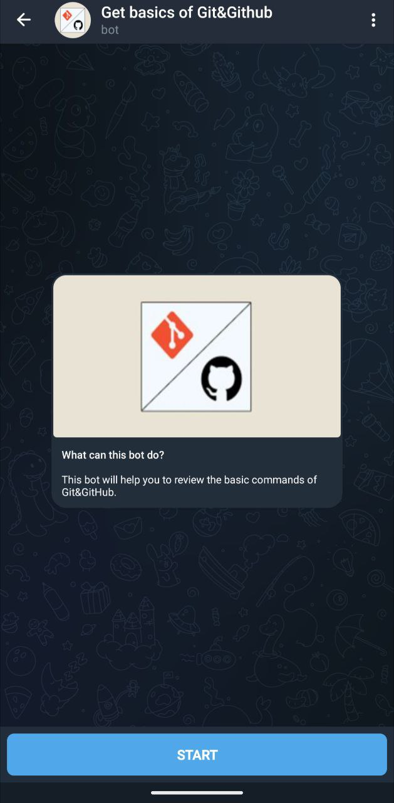
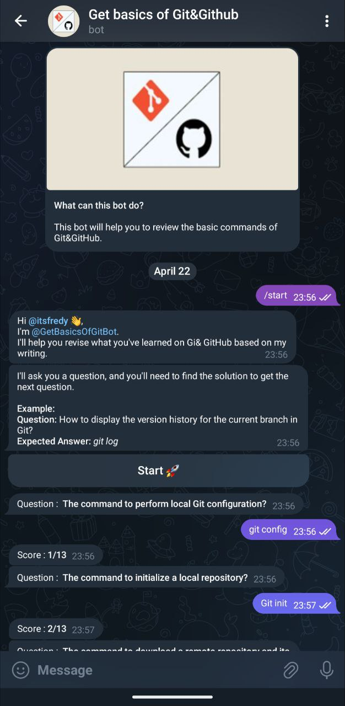

# Get Basics Of Git Bot

<div align="center">
    
    
</div>

This project is a Telegram bot that poses questions about Git & GitHub.Directly linked to the personalized documentation that I have written.
The bot awaits the user response, checks its precision and goes to the following question if the answer is correct of false.


## How it works

The bot uses the [Python-Telegram-bot](https://python-telegram-bot.org/) to interact with the [Telegram API](https://core.telegram.org/bots/api)

## Prerequis

- *Python 3.8+* 
- The library: `https://github.com/python-telegram-bot/python-telegram-bot`


## Facility

1. Clone this repository: `git clone https://github.com/itsfredy/Gitbasicsbot.git`
2. Access the project directory: `cd gitbasicsbot`
3. Install the outbuildings: `pip install -r requirements.txt`
4. Add your Bot Telegram token to the `credentials.py` file.


## Use

1. Run the `gitbot.py` script.
2. In Telegram, find your bot and start interacting using the **/start** command.


## Contribution

Contributions are welcome !
Don't hesitate to open a way out or submit a merger request.
You can also add other question in the `questions.py` file like this :

```json
[
    "question",
    "answer"
]
```

## Author

- [@LikedIn](https://likedin.com/in/taboutsafredy)
- [@Telegram](https://t.me/itsfredy)

## What I learned

I learned to set up a **conversation management system** in the Bot.
And I also learned to make a project modular and usable by other SWEs.
In suppliance of small guides and documentation like this.

## Licence

This project is under license [MIT](https://opensource.org/licenses/mit).